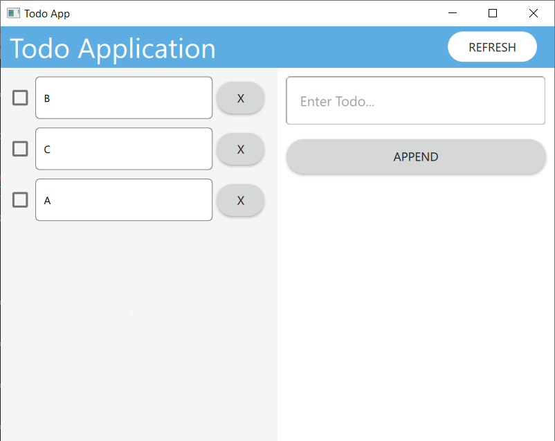

# Todo_Application_QT is a project that using QT to create a GUI application. 
  - I leverage a built-in class named QNetworkAccessManager to interact with the API of the web server.
  - Folder Structrure :
    - todo : Client (QT/QML , C++)
    - web_server : Rest API server by Flask (Python)
  - Features :
    - Add new TODO
    - Get all TODOs
    - Refresh all TODOs when json file are changed
    - Check TODO
    - Delete TODO
## Demo

